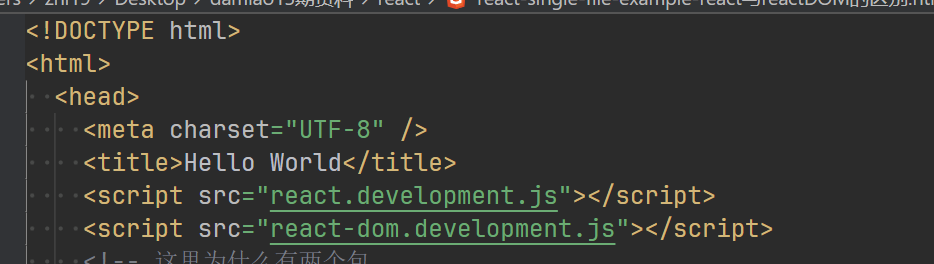
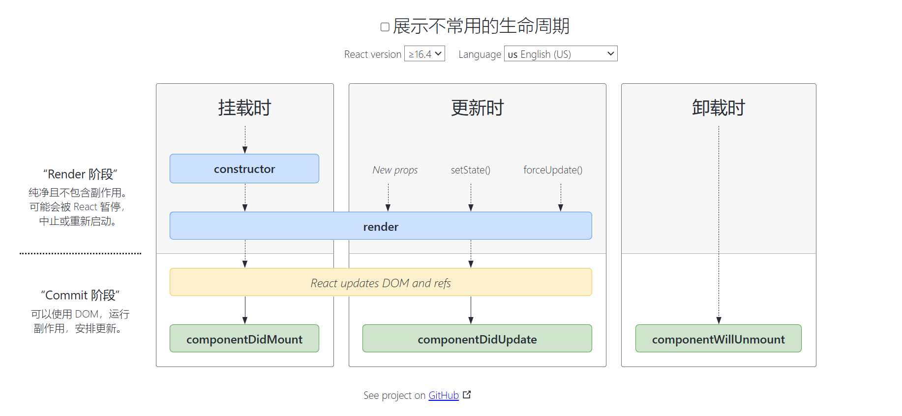

# 1. 初识react
## 这里为什么有两个包？

1. React是用于创建和管理组件的，但不负责渲染它。ReactDOM是用于将react组件渲染到DOM中的
2. 实际上还存在：
   1. ReactCanvas（非官方）可以将react组件渲染到Canvas里
   2. ReactConsole（非官方，实际名字叫Ink）可以将react组件渲染到控制台里
   3. ReactNative（官方）可以将react组件用操作系统原生(native)ui渲染，以达到更高的性能
   4. 每个系统/编程环境中的组件库是不一样的，所以我们会定义一组通用的组件，这些组件在不同的环境实现方式不一样，但组件最终的渲染效果是一样的

## sourcemap是什么？
1. 运行的是编译后/压缩后等的代码，调试的时候还是调试的源代码是怎么回事？
2. 编译结果代码的最后一行
### sourceMappingURL=xxxxxx.js.map 是什么意思？
### 它里面记录了什么信息？
1. 它记录了源代码的文件名及文件内容。所以这个文件在上线后一定一定是不能泄露的，别一起把这个文件也上线了

## 在class组件的setState是同步的还是异步的？
1. 在16版本的时候，有时同步有时异步
   1. 同步时会立即合并state并且立即更新dom
   2. **什么时候同步？**当setState所在调用栈中没有一系列的react函数时。在Ajax回调/或异步函数的回调中调用时是同步的。在事件中调用是异步的。
2. 在最新的18版本中，始终是异步的
   1. 通过queueMicrotask/postMessage触发的（事件中，直接由我们调用）
3. 17版本我不记得了/不知道。因为17版本被react官方当做一个过渡版本，所以很多公司根本不用的

## setState做了什么？
1. 保存新的数据，并把数据和之前的对象进行合并成新的state（自己写的）

## react生命周期示意图
1. https://projects.wojtekmaj.pl/react-lifecycle-methods-diagram/
 

# 函数组件
1. jsx和vue3都会忽略html代码行首行尾的空白,vue2不会
2. react的useXxxx函数在同一个组件实例内，不能改变调用顺序
3. 函数组件并没有生命周期，不过有类似的功能
在同一个组件的多次渲染中，也不能改变调用次数
## 面试必问：为什么hook不能改变调用顺序？
1. 错误原因：因为使用了链表嘛，当然不能换顺序，因为链表只能顺序访问
2. 正确原因：并不是因为链表，而是因为api的形式，useState函数只能隐含的知道自己的调用顺序，所以只能返回对应顺序的状态，而与该状态的用处（名字）无关。并不是因为链表，而是因为api的形式，useState函数只能隐含的知道自己的调用顺序，所以只能返回对应顺序的状态，而与该状态的用处（名字）无关。
## react的hook函数
1. 只能在函数组件内调用，由于hook函数只能通过感知自己隐含的调用顺序来返回组件不同的状态
2. 同一个函数在一个组件内多次调用，会返回不同的值

**在react18中，函数组件的setState也是异步的

## js的label语法（了解一下）
1. js的label语法，（标识符后面跟一个冒号）:可以理解为对某一行代码标记位置（或者说起名字）
2. 有的语言有一个goto语句，可以直接让代码跳转到某个label对应的行去执行
3. js中的唯一用法：在内层循环break外层循环
```js
function foo() {
  a:
  for(;;) {
    b:
    for(;;) {
      break a;
    }
  }
}
```
## 面试如果问到ref如何回答？
1. 首先它是用来指向元素的
2. 现在也用来模拟其它语言传引用的所有场景，或者说所有需要不同位置的代码共享数据时的场景（一个地方改了，另一个地方能读到这个改动甚至能感应到(响应式)，如vue）

## react中的ref相关
1. 字符串ref的用法现在不推荐了！（为什么？）
   1. 因为react代码内部在实现这种用法时太过复杂，远比对象ref和函数ref要复杂的多。并且函数组件不支持字符串ref,只支持函数ref和对象ref
   2. 对象ref:创建一个ref对象传给jsx的ref属性，jsx实例化后会被该ref的current指向
   3. 函数ref:创建一个函数并传给jsx的ref属性，jsx实例化为元素或组件后该函数会被调用被传入元素或组件做为其唯一参数（函数ref的另一个问题是名字不好起，要为函数自身起个名字，又要为名字挂在哪个字段上想一个名字，而且这两个名字不能一样）
   4. class组件可以接ref，最终该ref指向class组件的实例
   5. 函数组件不能接ref，因为函数组件没有实例（react会为函数组件创建所谓的fiberNode,但它是react内部实现，我们拿了也没用），同时函数组件内部不能使用字符串ref指向其它元素或组件

## 其它点
1. class组件除了state上可以放数据以外，this上也可以随意放数据（但注意不要覆盖别的属性）
2. 而且直接挂在this上的属性修改时自然不会触发组件的更新（因为没有通过setState修改，再说了，setState也只能修改this.state属性）
3. **函数组件有什么地方能够放数据并且在更新的时候不会触发组件的更新？**
   1. 全局变量，可以，但是意味着这个组件的所有实例会共享这些数据
   2. ref，一个组件实例的某一个名字的ref会在这个组件的生命周期内始终指向一个ref对象。
## react的hook函数为什么不能更换顺序或者放在if里面？vue呢？（重要）
1. 因为hook函数是通过隐含的调用顺序来区分不同的hook调用的
2. 函数组件的多次运行中，同一调用顺位的hook函数是对应的，会对应相同的状态或对比各自的依赖
3. vue根本不存在这个问题，因为vue的setUp函数在一个组件实例上，只运行一次

```js
var f = useCallback(function XXX(){},   [deps])
等价于
var f = useMemo(() => function XXX(){},   [deps])

function useCallback(f, deps) {
	return useMemo(() => f, deps)
}


```

## 函数在浏览器重绘的时机
1. setTimeout触发的回调在重绘之后调用
2. 而已经成功的promise触发的回调在重绘之前调用，queueMicrotask也一样

**vue的expose:10-11 22：53**

## forwardRef
https://19.react.dev/reference/react/forwardRef

In React 19, forwardRef is no longer necessary. Pass ref as a prop instead.

## 高阶组件
高阶函数：一个函数接收或返回一个函数它就是高阶组件

高阶组件：一个函数接收并返回一个组件那么它就是高阶组件

在React里面，组件是 函数 或是 构造函数（class）

所以高阶组件它也是高阶函数

react里面的高阶组件函数一般以with开头后面跟上功能

以代表这个高阶组件为传入的组件带来了什么功能


一般来说高阶组件函数返回的组件会以某种方式使用传入的组件

## react性能
web性能优化
  网络传输的性能优化
  代码运行的性能优化
react性能优化

反问：你是想优化运行性能还是优化传输性能？

## react中如何使用纯js库？（没有适配react的库）
```js
在react中使用高德地图的大致代码：

function AMap(props, ref) {
  var container = useRef()
  
  useEffect(() => {
    const map = new AMap.Map(container.current);
    ref.current = map
  }, [])

  return <div ref={container}></div>
}

var map = React.createRef()

<AMap ref={map}/>
```

## use
```js
react 19 中有一个叫use的hook函数
目前有两种用法：

function Test() {
  var p = useMemo(() => new Promise(), [xxx])

  var value    = use(p)

  if (xxx) {
    var color = use(ColorContext)
    var color = useContext(ColorContext)
  }

}

var MarkdownDocument = React.lazy(() => import('MarkdownDocument.js'))

<Suspense fallback={<div>'loading...'</div>}>
  <Test />
  <Suspense fallback={<div>'loading...'</div>}>
    <MarkdownDocument />
  </Suspense>
</Suspense>
```
这个use函数可以放进if里，可以像任何函数一样使用
原理是：它接收的对象，所以不根据自己的顺序来区分，而是根据自己的参数来区分需要返回的值
一定要传不是现场创建的对象，而是之前已经创建好的对象
接promise的时候不要传新创建的，而要传在组件外面创建的
